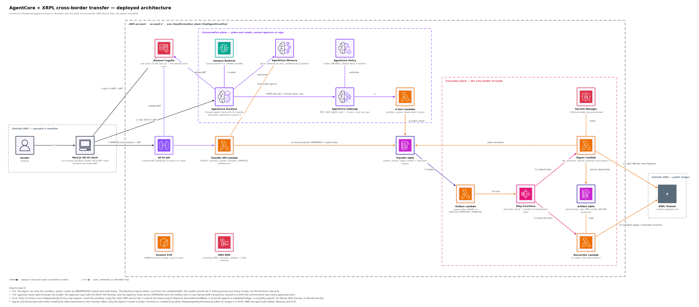

# AgentCore + XRPL Cross-Border Transfer POC

A safety-governed cross-border remittance sample built with Amazon Bedrock
AgentCore, Strands Agents, AG-UI, AWS Step Functions, DynamoDB,
Amazon Cognito, and XRPL Testnet.

The sample demonstrates exact-output issued-currency transfers with bounded
`SendMax`, an XRP-denominated x402 service fee, direct Testnet wallet delivery,
and simulated local-fiat payout. The language model can discover
[corridors](https://en.wikipedia.org/wiki/Remittance) — the remittance-industry
term for a fixed source-currency → destination-currency route, such as
USD→MXN (see `config/corridors.example.json`) — obtain quotes, create
transfer intents, and read status. It cannot approve, sign, or execute a
payment.

> **Testnet demonstration only**
>
> All currencies, rates, sanctions decisions, and fiat payouts are demo
> fixtures. The code and infrastructure reject non-Testnet XRPL configuration.
> Mainnet, real custody, production KYC/AML, and real bank movement are outside
> this sample's scope.



_Regenerate with `pip install -r diagrams/requirements.txt && python3 diagrams/render_architecture.py` (icons: see [`diagrams/icons/SOURCE.md`](diagrams/icons/SOURCE.md))._

## Quickstart

There are three levels of testing. Each one adds more of the real system. Levels 1
and 2 need no AWS account and move no funds.

| Level | What it proves | Needs | Time |
|-------|----------------|-------|------|
| 1. Verify | Lint, unit tests, builds, and CDK synth all pass | Python, `uv`, Node | ~5 min |
| 2. Local API | Quote → intent → approval works, and a tampered approval is refused | Level 1 | ~2 min |
| 3. End to end | The agent quotes, you approve, and XRPL Testnet settles | AWS sandbox | ~30 min |

### Level 1: verify the source

```bash
git clone https://github.com/aws-samples/sample-xrpl-agentic-payments.git
cd sample-xrpl-agentic-payments
uv sync --extra dev
npm ci
cp .env.example .env
./scripts/verify.sh
```

Success: the script exits 0 after Ruff, Pytest, TypeScript, Vitest, the
Next.js build, `npm audit`, and `cdk synth`.

### Level 2: drive the REST API locally

This runs the transfer API in memory, using a demo identity in place of Cognito.
It exercises quoting and the approval commitment. It does not sign or submit
anything to XRPL.

Terminal 1:

```bash
set -a; source .env; set +a
ALLOW_DEMO_AUTH=true uv run uvicorn xrpl_agentcore.api:app --port 8000
```

Terminal 2. Port 8000 serves only the API; `/` returns `{"detail":"Not Found"}` by design.

```bash
api() { curl -s -H 'X-Demo-User: sample-user' -H 'Content-Type: application/json' "$@"; }

api http://localhost:8000/v1/corridors

quote_id=$(api -X POST http://localhost:8000/v1/quotes -d '{
  "corridor_id": "usd-mxn-testnet", "destination_amount": "10",
  "payout_mode": "LOCAL_FIAT_SIMULATED", "recipient_name": "Demo Recipient",
  "recipient_country": "MX", "payout_alias": "fixture-bank-token"}' \
  | python3 -c 'import json,sys; print(json.load(sys.stdin)["quote_id"])')

intent=$(api -X POST http://localhost:8000/v1/transfers -d "{\"quote_id\": \"$quote_id\"}")
transfer_id=$(echo "$intent" | python3 -c 'import json,sys; print(json.load(sys.stdin)["transfer_id"])')
approval_hash=$(echo "$intent" | python3 -c 'import json,sys; print(json.load(sys.stdin)["approval_hash"])')

# Approve with the exact commitment: expect "status": "APPROVED"
api -X POST "http://localhost:8000/v1/transfers/$transfer_id/approve" \
  -d "{\"approval_hash\": \"$approval_hash\", \"idempotency_key\": \"quickstart-0001\"}"
```

Success: the intent comes back `AWAITING_APPROVAL`, then `APPROVED`. An approval
whose `approval_hash` does not match the quoted terms returns `409`.

### Level 3: end to end on AWS and XRPL Testnet

Use a disposable sandbox account. This creates billable AWS resources and
three Secrets Manager secrets. See [Prerequisites](#prerequisites) for
Bedrock model access. No local Docker is needed; `deploy.sh` builds the
Runtime image with AWS CodeBuild.

```bash
export AWS_PROFILE=<sandbox-profile>
cp -n .env.example .env   # skip if you already have one from Level 1

# AWS_DEFAULT_REGION in .env is the only place the deploy region lives; the
# default there is us-west-2 — edit it to deploy elsewhere.

# 1. Create Testnet wallets, trust lines, and liquidity; store 3 signer seeds.
uv run python scripts/provision_testnet.py --write-secrets

# 2. Verify the ledger state and write the public wallet addresses to .env.
uv run python scripts/verify_and_set_env.py

# 3. Deploy. deploy.sh reads the region and addresses from .env, and, after
# enabling the Runtime, writes web/.env.local from the stack's own outputs.
# First time per account: npx cdk bootstrap aws://<account-id>/<region from .env>
./scripts/deploy.sh

# 4. Create a sign-in user and start the app.
POC_USER_EMAIL=demo@example.com POC_USER_PASSWORD='<strong-disposable-password>' \
  ./scripts/create_poc_user.sh
npm run dev --workspace web
```

`deploy.sh` refuses an uncommitted tree. Commit first, or prefix it with
`ALLOW_DIRTY_DEPLOY=true`.

Then open [http://localhost:3000](http://localhost:3000) and sign in:

1. Select **Simulated fiat**. The assistant returns a quote card.
2. Reply `create the transfer intent`. The assistant renders an approval card
   showing the exact terms.
3. Select **Approve and execute** on the card. The model cannot do this step.
4. Watch the card move through `FEE_PAID` → `SUBMITTED` → `SETTLED` →
   `COMPLETED`. The card links the x402 fee and payment transaction hashes to
   testnet.xrpl.org.

A second one-click starter, **Direct wallet**, quotes 5 MXN for direct XRPL
wallet delivery instead of the simulated payout. To repeat the same checks
without the browser, see [Live acceptance](#live-acceptance). For the
mechanics behind Level 3's commands, see
[Deployment reference](#deployment-reference). Remove everything with
[Cleanup](#cleanup).

`.env`, `web/.env.local`, and generated fixture files are gitignored. Never
commit wallet seeds, signed transaction blobs, AWS credentials, or Cognito
tokens.

### Local AG-UI Runtime health check

Starts the same Runtime container `deploy.sh` deploys, without AWS
credentials or a model call — only `/ping`:

```bash
set -a; source .env; set +a
ALLOW_DEMO_AUTH=true uv run python -m xrpl_agentcore.agent_runtime
```

```bash
curl http://localhost:8080/ping
```

A real chat additionally needs AWS credentials, `AGENTCORE_GATEWAY_URL`,
Bedrock model access, and the deployed Gateway targets — Quickstart Level 3
sets all of that up.

## What the sample includes

- Native AG-UI AgentCore Runtime with `POST /invocations`, `GET /ping`, SSE,
  and a Strands agent.
- AgentCore Gateway exposing exactly four planning and status tools.
- AgentCore Policy in enforcement mode with default-deny behavior.
- Cognito authentication and trusted owner identity propagation.
- Opt-in AgentCore Memory limited to structured user preferences.
- Canonical decimal amounts and SHA-256 quote and approval commitments.
- Transactional approval plus execution outbox creation.
- Idempotent Step Functions execution independent of the model session.
- Separately KMS-encrypted transfer and signed-artifact DynamoDB tables.
- Persist-before-broadcast signing and same-blob XRPL resubmission.
- Strict validated-ledger reconciliation and partial-payment rejection.
- Replaceable `XrplX402Adapter` for the XRP service-fee lane.
- AG-UI application-owned quote, approval, progress, receipt, and failure
  components with refresh-safe status recovery.
- Disposable XRPL Testnet issuer, trust-line, liquidity, wallet, deployment,
  and acceptance scripts.

## Architecture and trust boundaries

```text
Browser -> Next.js AG-UI BFF ------> AgentCore Runtime -> Gateway + Policy
   |                                                        |
   +-> authenticated REST API -> DynamoDB outbox             |
                                  |                          |
                                  v                          |
                            Step Functions                   |
                             |          |                    |
                             v          v                    |
                          Signer     Reconciler --------------+
                             |          |
                             +-----> XRPL Testnet
```

Approval always uses the authenticated REST API, never an AG-UI event or model
tool result. Runtime has no access to signer seeds, signed blobs, payment
tables, Lambda execution functions, or Step Functions start permissions.

- [Detailed architecture and safety model](docs/architecture.md)
- [Standalone ASCII architecture](docs/architecture-ascii.md)
- [Control-flow sequence, with trust-boundary swimlanes](docs/sequence.md)
- [Deployment details](docs/deployment.md)
- [Research and source mapping](docs/research.md)
- [Recorded live Testnet evidence](docs/live-testnet-evidence.md)

## Repository layout

| Path | Purpose |
| --- | --- |
| `web/` | Next.js, native AG-UI client (`@ag-ui/client`), Cognito, and application-owned cards |
| `src/xrpl_agentcore/` | FastAPI, AgentCore Runtime, domain, signing, reconciliation, and x402 adapter |
| `infra/` | TypeScript CDK infrastructure and least-privilege assertions |
| `scripts/` | Verification, fixture provisioning, deployment, and live acceptance |
| `config/` | Committable example corridor plus ignored generated fixture config |
| `tests/` | Python domain, API, security, idempotency, and XRPL tests |
| `docs/` | Architecture, deployment, research, and acceptance evidence |

## Prerequisites

For local tests:

- Python 3.13
- [`uv`](https://docs.astral.sh/uv/)
- Node.js 22.12 or newer
- npm

For full deployment and live Testnet acceptance:

- An AWS sandbox account with credentials for CDK, IAM, KMS, DynamoDB, Lambda,
  API Gateway, Cognito, Step Functions, ECR, CodeBuild, S3, Secrets Manager,
  Amazon Bedrock, and Amazon Bedrock AgentCore.
- Bedrock model access for the configured Sonnet inference profile.
- AWS CLI v2.
- CDK bootstrap permission in your chosen region.
- Network access to the XRPL Testnet faucet and JSON-RPC endpoint.

No local Docker or other container engine is needed. `deploy.sh` builds and
pushes the ARM64 Runtime image with AWS CodeBuild.

**Region:** set by `AWS_DEFAULT_REGION` in `.env` — the only place a default
region lives, `us-west-2` there; edit it to deploy elsewhere. Claude Sonnet
4.5 is invoked through the `us.` cross-region inference profile, which fans
out only to `us-east-1`, `us-east-2`, and `us-west-2` regardless of which of
those three you deploy to — deploying outside them needs model access and an
inference profile for that region, and AgentCore Runtime, Gateway, Memory,
and Policy available there too.

### Installing the prerequisites

macOS (Homebrew):

```bash
brew install python@3.13 node awscli
curl -LsSf https://astral.sh/uv/install.sh | sh
```

Linux (Debian/Ubuntu):

```bash
curl -fsSL https://deb.nodesource.com/setup_22.x | sudo -E bash -
sudo apt-get install -y nodejs python3.13

curl -LsSf https://astral.sh/uv/install.sh | sh

curl "https://awscli.amazonaws.com/awscli-exe-linux-x86_64.zip" -o awscliv2.zip
unzip awscliv2.zip && sudo ./aws/install
```

Windows: install [Python 3.13](https://www.python.org/downloads/),
[Node.js 22 LTS](https://nodejs.org/), [`uv`](https://docs.astral.sh/uv/getting-started/installation/),
and [AWS CLI v2](https://docs.aws.amazon.com/cli/latest/userguide/getting-started-install.html)
from their official installers.

`npm` ships with Node.js; there's nothing to install separately. `boto3` is a
Python dependency of this project, not a system tool — `uv sync --extra dev`
(Quickstart Level 1) installs it automatically.

For full deployment, also authenticate the AWS CLI once:

```bash
aws configure sso   # or: aws configure, for long-lived access keys
aws sts get-caller-identity   # confirms it can authenticate
```

Confirm versions:

```bash
python3 --version  # 3.13.x
node --version      # v22.12.0 or newer
npm --version
uv --version
aws --version       # aws-cli/2.x
```

## Deployment reference

Detail behind Quickstart Level 3's commands.

**Wallets.** `provision_testnet.py --write-secrets` creates eight disposable
Testnet wallets, USD and MXN issuers, trust lines, balances, and USD/MXN
order-book liquidity. It writes `.testnet-fixtures.json` (mode `0600`,
contains seeds, gitignored), `config/corridors.json` (gitignored), and the
three signer seeds into Secrets Manager. Each wallet has one role, and the
roles cannot be merged: XRPL rejects a Payment to its own account, so the
fee payer and fee merchant must differ; an issuer cannot hold its own token,
so neither issuer can double as the sender or a destination.

| Wallet | Role | Deployment value |
|--------|------|------------------|
| `execution` | Sender. Holds USD and signs the exact-output Payment with bounded `SendMax`. | `XRPL_EXECUTION_ADDRESS` (seed in Secrets Manager) |
| `payout` | Destination for simulated local-fiat payout, standing in for the payout partner. | `XRPL_PAYOUT_ADDRESS` |
| `fee_payer` | Pays the x402 XRP service fee, kept separate from the transfer principal. | `XRPL_FEE_PAYER_ADDRESS` (seed in Secrets Manager) |
| `fee_merchant` | Receives the service fee, and refunds it if the transfer fails. | `XRPL_FEE_MERCHANT_ADDRESS` (seed in Secrets Manager) |
| `usd_issuer` | Issues the Testnet USD token. | `XRPL_USD_ISSUER_ADDRESS` |
| `mxn_issuer` | Issues the Testnet MXN token. | `XRPL_MXN_ISSUER_ADDRESS` |
| `recipient` | Destination for direct-wallet delivery in the web starter prompt. | `NEXT_PUBLIC_DEMO_RECIPIENT_ADDRESS` |
| `liquidity` | Market maker. Places the USD/MXN offer the payment path crosses. | none |

`verify_and_set_env.py` re-reads the validated ledger state for every
fixture and, only if every check passes, writes the seven public addresses
above into `.env` (creating it from `.env.example` if absent; mode `0600`;
seeds never written). A value already exported in the shell takes
precedence. `--verify-only` checks the ledger without writing `.env`.

**Deploy.** `deploy.sh` reads the region and the six wallet addresses from
`.env`, builds the ARM64 Lambda layer, runs `verify.sh`, then deploys in two
CDK passes: the first creates ECR, a CodeBuild project, and supporting
services with `DeployAgentRuntime=false`; CodeBuild then builds and pushes
the ARM64 Runtime image; the second pass enables the Runtime with
`DeployAgentRuntime=true`, referencing the tag CodeBuild just pushed. A
Runtime can't reference an ECR tag that doesn't exist yet, which is why the
two passes can't merge. The first pass reruns on retry until the Runtime
exists, so a prior failed run is safe to re-attempt.

After the Runtime pass, `deploy.sh` calls `write_web_env.py`, which reads
the API URL, Cognito user pool, and Runtime ARN from the stack's
CloudFormation outputs, reads the fixture recipient and payout alias from
`.env`, and writes all six into `web/.env.local`. None of these are secrets
— they're endpoints and IDs — but `AGENTCORE_RUNTIME_URL` is still
server-only: never prefix it with `NEXT_PUBLIC_`, and never expose AWS
credentials to the browser. Run `write_web_env.py` directly to refresh
`web/.env.local` without redeploying — for example, against a stack
deployed earlier, or a different `STACK_NAME`/`AWS_DEFAULT_REGION`.

## Live acceptance

Before executing payments, independently verify the fixture ledger state:

```bash
uv run python scripts/verify_and_set_env.py --verify-only
```

The direct XRPL engine acceptance moves only disposable Testnet assets:

```bash
uv run python scripts/live_xrpl_acceptance.py
```

For deployed REST acceptance, obtain a Cognito access token and run:

```bash
COGNITO_ACCESS_TOKEN="$COGNITO_ACCESS_TOKEN" \
uv run python scripts/live_acceptance.py \
  --api-url "$NEXT_PUBLIC_API_BASE_URL" \
  --recipient-address "$NEXT_PUBLIC_DEMO_RECIPIENT_ADDRESS"
```

The acceptance script replays approvals and requires one idempotent workflow,
one x402 fee hash, and one transfer hash per lane.

## Important safety invariants

- Runtime can call only corridor, quote, intent-creation, and status tools.
- Approval binds owner, transfer ID, payout mode, assets, issuers, recipient
  and tag, route, `SendMax`, slippage, fee, expiry, and nonce.
- Approval and outbox creation are transactional and idempotent.
- Signers persist encrypted signed artifacts before broadcast.
- Ambiguous submission enters `SUBMISSION_UNKNOWN`; it is never immediately
  treated as failure.
- Reconciliation resubmits only the same signed blob and declares settlement
  only after strict validated-ledger checks.
- AG-UI state excludes wallet seeds, signed blobs, bank data, JWTs, approval
  credentials, full recipient details, and other sensitive values.
- Application-owned components render known financial events; model-generated
  HTML or JavaScript is never rendered.

## Cleanup

Destroy the CDK stack when the sandbox is no longer needed:

```bash
npx cdk destroy XrplAgentCorePoc \
  --app "npx ts-node --prefer-ts-exts infra/bin/app.ts"
```

The fixture script creates signer secrets outside the stack. Review and delete
the three `xrpl-agentcore/testnet/*-seed` secrets separately after confirming
that no other test deployment uses them. Testnet wallets and ledger
transactions remain public and cannot be deleted.

## License

Apache-2.0. See [LICENSE](LICENSE).
