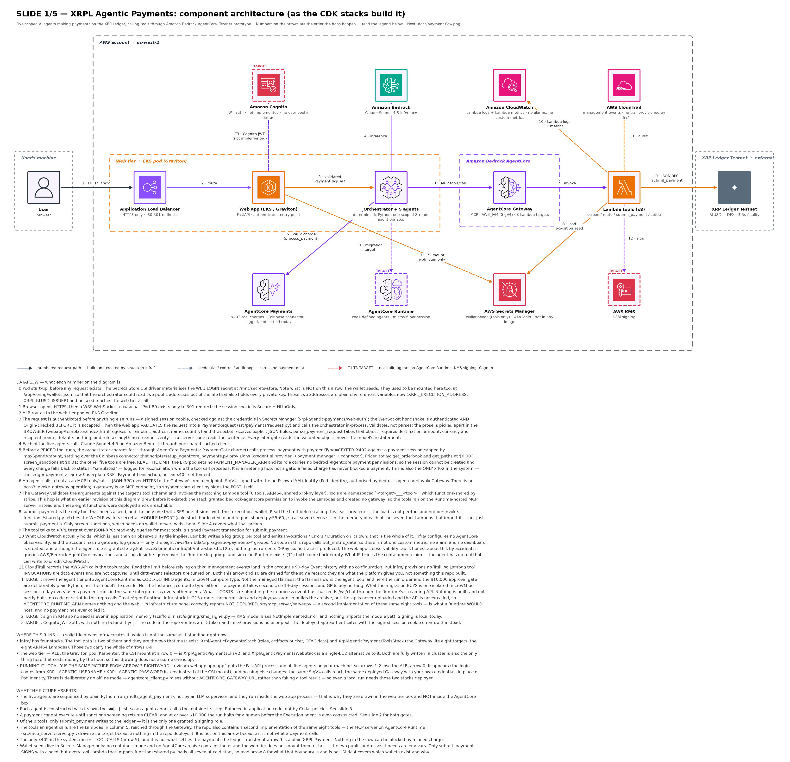
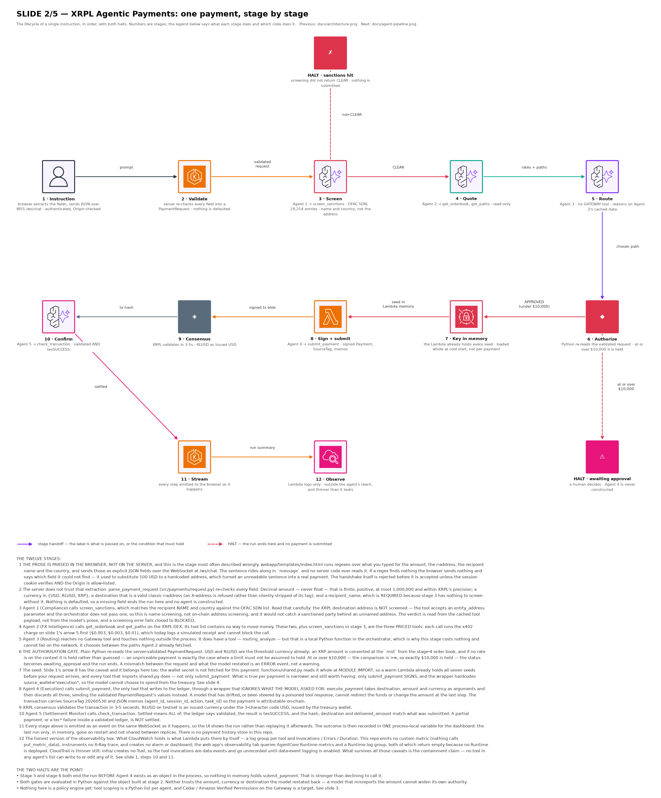
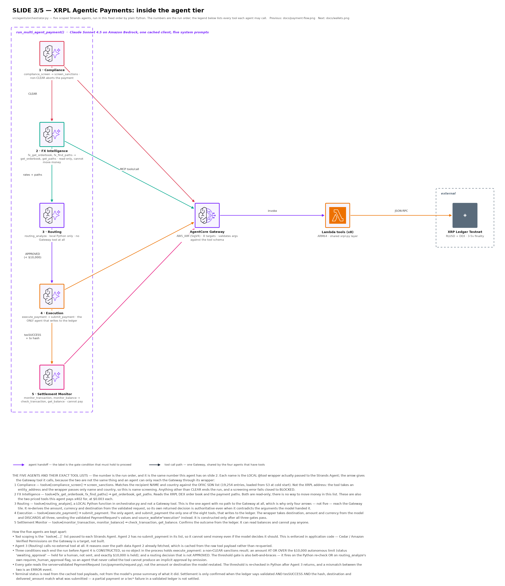
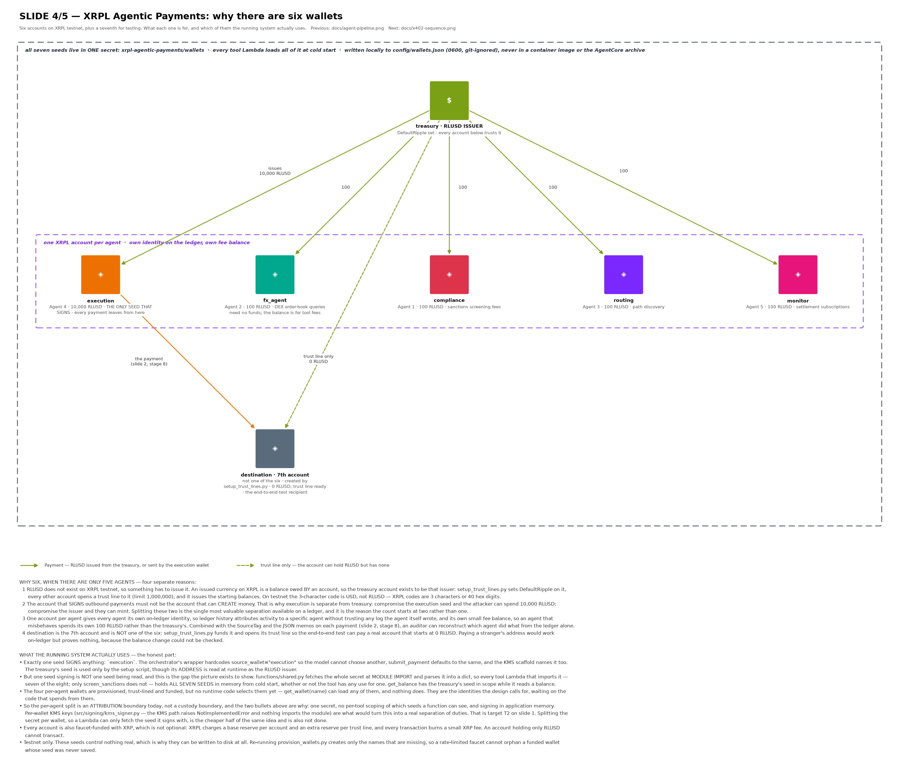
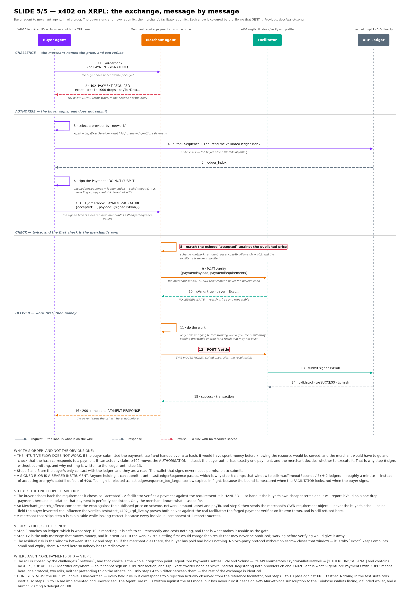

# XRPL Agentic Payments

**AI agents making agentic payments on the XRP Ledger, hosted on Amazon Bedrock AgentCore.**

XRPL Agentic Payments is a prototype showing an AI agent that receives a
natural-language payment instruction, reasons through compliance and routing,
and executes a real payment on the XRPL testnet — settling in 3-5 seconds.

Two different payments happen here, and they are worth separating up front. The
**payment** is a native XRPL `Payment` transaction, signed by the execution
wallet. **x402** is a separate, much smaller thing: a per-call charge on the
priced tools, metered through Amazon Bedrock AgentCore Payments over a Coinbase
connector. See [AgentCore Payments](#agentcore-payments-x402-tool-charges) for
what that does and does not do today.

> This is a research prototype, not a production payments system. It runs
> entirely on the XRPL **testnet** (no real funds) and is meant to demonstrate
> the architecture pattern, not to be deployed as-is for real transactions.

## Architecture

Five slides, in reading order. Each one answers a different question, and every
arrow, tile and message is numbered with a legend underneath the picture, so a
slide can be read without reading the code. Slides 1-4 are views of this system;
slide 5 is the x402 protocol itself, so it is a sequence diagram rather than a
component grid.

| # | Slide | Answers |
|---|-------|---------|
| 1 | [`docs/architecture.png`](docs/architecture.png) | Where every component runs, which side of the AWS account boundary it is on, and in what **order** the hops happen (steps 0-11, plus targets T1-T3). |
| 2 | [`docs/payment-flow.png`](docs/payment-flow.png) | What happens between a person typing an instruction and the ledger having settled it — 12 stages **and the two places the run halts without a payment**. |
| 3 | [`docs/agent-pipeline.png`](docs/agent-pipeline.png) | Inside the agent tier: the 5 agents, the fixed order they run in, and the exact `tools=[...]` list each one is allowed to call — the local `@tool` wrappers, and which Gateway tool each wrapper reaches. |
| 4 | [`docs/wallets.png`](docs/wallets.png) | Why there are **6 wallets for 5 agents** (plus a 7th for testing), what each one is for, and which of them the running system actually uses. |
| 5 | [`docs/x402-sequence.png`](docs/x402-sequence.png) | What is actually on the wire between a buyer agent and a merchant agent — 16 messages in order, **which single one of them moves money**, and where AgentCore Payments plugs into the same exchange. |

### 1. Components and the numbered request path



*The request path as the CDK stacks build it: browser → ALB → web app (EKS
Graviton) → orchestrator + 5 agents **in that same pod** → AgentCore Payments
(step 5, the x402 charge on a priced tool) → AgentCore Gateway → Lambda tools →
XRPL testnet. A solid tile is created by a stack in `infra/`, which is not the
same as it standing right now — the slide's "WHERE THIS RUNS" legend says which
stacks the tool path needs (Core + Tools) and what changes when you run the web
tier locally instead of paying for a cluster. Moving the agent tier onto AgentCore
Runtime, signing in KMS, and Cognito JWT auth are drawn as targets (T1, T2, T3)
because they are designed or half-written but not built at all.*

### 2. One payment, stage by stage



*The lifecycle of a single instruction. The two halts are the point: a non-CLEAR
sanctions result (stage 3) and an amount at or over $10,000 (stage 6) both end
the run **before the Execution agent is constructed**.*

### 3. Inside the agent tier



*The orchestrator (`src/agents/orchestrator.py`) and its 5 scoped agents —
compliance, FX intelligence, routing, execution, settlement monitor — sequenced
by plain Python, not by an LLM supervisor. Agent 3 (Routing) has no path to the
Gateway at all.*

### 4. Why six wallets



*One issuer (RLUSD has to be issued by someone), one execution wallet that signs
payments and is deliberately **not** the issuer, and one account per agent for
on-ledger attribution — plus a 7th `destination` account so the end-to-end test
can pay something that starts at zero.*

### 5. The x402 exchange, message by message



*The one diagram here that is not about this repository's components — it is the
protocol, and it would look the same in any correct x402 v2 implementation. Three
things in it catch people out. The buyer **signs but never submits**: the
merchant's facilitator submits, so what crosses the wire is an authorisation for
exactly one payment, not funds and not a receipt. `/verify` touches no ledger, so
it is free and repeatable, which is what makes it usable as the gate; `/settle` is
the only message that moves money and it is sent **after** the work exists. And
step 8 — the merchant comparing the buyer's echoed `accepted` terms against its
own published price — is the step implementations omit, because a facilitator
verifies a payment against the requirement it is handed, so a merchant that
forwards the buyer's terms will be told a one-drop payment is perfectly valid.
The slide also marks what is exercised: steps 1-10 are verified against XRPL
testnet, and steps 12-16 are implemented but never run, because nothing in the
test suite calls `/settle`.*

### Regenerating the slides

The diagrams are generated from the specs in `diagrams/`. matplotlib is not a
runtime dependency, so it has its own requirements file.

The icons are official AWS vendor marks and are **not** committed — fetch them
first, following [`diagrams/icons/SOURCE.md`](diagrams/icons/SOURCE.md), which
lists the source package and path for every file. Until they are in place each
renderer stops and names the icon it is missing. Slide 5 draws no icons, so it
renders without them.

```bash
pip install -r diagrams/requirements.txt

python3 diagrams/render_architecture.py     # slide 1 (also updates webapp/static/assets/)
python3 diagrams/render_payment_flow.py     # slide 2
python3 diagrams/render_agent_pipeline.py   # slide 3
python3 diagrams/render_wallets.py          # slide 4
python3 diagrams/render_x402_sequence.py    # slide 5
```

Slides 1-4 share the grid engine in `diagrams/diagram_lib.py`. Slide 5 has its own
small engine in `diagrams/render_x402_sequence.py`, because a sequence diagram's
vertical axis is time on a lifeline rather than a row in a grid — laid out on the
shared grid it would need one tile per message and stop being a sequence diagram.

Each renderer runs a set of self-checks **before** it draws, and refuses to write a
PNG if any of them fail: arrows that cross unrelated tiles, overlapping text,
missing glyphs, stale account IDs, and — on slide 5 — responses that arrive before
the call they answer, plus every "step N" in the caption cross-checked against the
message that currently holds that number, so inserting a message breaks the build
instead of silently misnumbering the prose.

<details>
<summary>Text version</summary>

```
Browser (FastAPI, on the EKS Graviton pod eks-stack.ts builds or on your laptop —
        the path below the first arrow is identical either way)
        │  orchestrator + 5 scoped agents run in this same process
        ├──► Amazon Bedrock AgentCore Payments (x402 charge on a priced tool;
        │    logged, not settled — no payment manager is wired into the pod)
        ▼
Amazon Bedrock AgentCore Gateway (AWS_IAM, MCP tools/call)
        │
        ▼
Lambda tools x8 (sanctions screening, pathfinding, payment execution, settlement)
        │
        ▼
XRP Ledger Testnet (RLUSD, DEX, 3-5s deterministic finality)
```

</details>

See [`DESIGN.md`](./DESIGN.md) for the full design document and
[`ripple-agentic-ai-payments.md`](./ripple-agentic-ai-payments.md) for
background research on the use case.

## Prerequisites

- Python 3.11+ (`pyproject.toml`'s floor; the container images pin 3.13, and the
  tool Lambdas run the `python3.14` runtime)
- Node.js 20+ (for the CDK infrastructure)
- An AWS account with credentials configured (`aws configure`)
- [AWS CDK](https://docs.aws.amazon.com/cdk/v2/guide/getting_started.html) v2
  (`npm install -g aws-cdk`)
- Access to Amazon Bedrock models in your target region (enable model access
  in the Bedrock console first)

## Quick start (local)

What runs with no AWS at all: the test suites, the web UI, and login. That is
enough to review the code and exercise every gate.

**Executing an actual payment is not local**, even with the process on your
laptop. Two hops need AWS:

* the five agents run inference on **Amazon Bedrock** (`BedrockModel`, so
  credentials plus model access in your region are required), and
* every tool call is a SigV4-signed POST to a **deployed AgentCore Gateway** —
  there is no local fallback to `functions/`, so `AGENTCORE_GATEWAY_URL` must
  point at a real Gateway. Without it the run stops and names the variable.

So the sequence for a full end-to-end payment is: deploy (below), set
`AGENTCORE_GATEWAY_URL` in `.env`, then run the web app locally against it.

```bash
git clone https://github.com/aws-samples/sample-xrpl-agentic-payments.git
cd sample-xrpl-agentic-payments

python -m venv .venv
source .venv/bin/activate   # Windows: .venv\Scripts\activate
pip install -r requirements.txt

cp .env.example .env
```

### 1. Provision XRPL testnet wallets

Creates and funds 6 wallets from the public XRPL testnet faucet. This writes
`config/wallets.json`, which contains private keys (seeds) for testnet
wallets only — it's git-ignored and regenerated by this script, never commit
it.

```bash
python scripts/provision_wallets.py
```

### 2. Set up RLUSD trust lines

Establishes the treasury wallet as a testnet RLUSD issuer, creates trust
lines between agent wallets, and issues starting balances.

```bash
python scripts/setup_trust_lines.py
```

### 3. Set your web login credentials

The web app requires `XRPL_AGENTIC_USERNAME` and `XRPL_AGENTIC_PASSWORD` to be
set — there is no default. Edit `.env` and set your own values.

### 4. Run the web app

Set `XRPL_AGENTIC_INSECURE_COOKIES=1` in `.env` first. The app enforces HTTPS —
it redirects HTTP to HTTPS and marks the session cookie `Secure` — and this flag
is what turns that off for `http://localhost`. Never set it in a deployment: the
session cookie authorises payments.

The image no longer contains `config/`, because wallet seeds in an image layer
are readable by anyone who can pull it, so mount the directory read-only:

```bash
docker build -f Dockerfile.webapp -t xrpl-agentic-payments-webapp .
docker run -p 8080:8080 --env-file .env \
  -v "$(pwd)/config:/app/config:ro" \
  xrpl-agentic-payments-webapp
```

or without Docker:

```bash
export $(grep -v '^#' .env | xargs)
python -m uvicorn webapp.app:app --host 0.0.0.0 --port 8080
```

Visit `http://localhost:8080` and log in with the username/password you set
in `.env`.

## Running the tests

Both suites are hermetic — no AWS credentials, no outbound network, and no
`config/wallets.json`. You can run them on a fresh clone before provisioning
anything, and they are the fastest way to check a change. (`test_webapp_auth.py`
does start a real server on a loopback port, because a WebSocket handshake
refusal cannot be observed through an in-process test client.)

```bash
python -m pytest tests/ -q        # 198 tests; pytest comes from requirements.txt

cd infra
npm install
npm test                          # 34 tests, asserting on the synthesized CloudFormation
npx tsc --noEmit                  # the stacks are TypeScript; a type error is a real error
```

| Suite | What it holds in place |
|-------|------------------------|
| `tests/test_payment_request.py` (55) | Server-side request validation: no defaulted financial fields, `Decimal` amounts, and the values that used to slip through — `NaN`, infinity, negatives, X-addresses, sub-drop precision |
| `tests/test_payment_gates.py` (46) | The $10,000 approval gate (including *exactly* $10,000, and XRP priced from either order-book orientation) and settlement confirmation — a partial payment, an overpayment or a payment to another destination is not "settled" |
| `tests/test_xrpl_core.py` (31) | Exact decimal→drops conversion, the attribution memo contract, order-book pricing convention, paginated `account_lines`, and that the Lambda tools never apply `nest_asyncio` (it breaks every tool on the `python3.14` runtime) |
| `tests/test_webapp_auth.py` (25) | Login, session-cookie signing and expiry, and that a WebSocket is refused *before* `accept()` without a session or with a foreign `Origin` |
| `tests/test_gateway_invocation.py` (19) | SigV4 signing and the `tools/call` request sent to the AgentCore Gateway, plus that the eight tool names match the eight CDK targets |
| `tests/test_sanctions_screening.py` (16) | OFAC matching: comma-swapped names, SDN names inside free text, placeholder rows skipped, and that a blank name errors rather than passing |
| `tests/test_payment_session.py` (6) | One session id per payment, reaching the on-ledger memo, never shared between two payments |

`infra/test/infra.test.ts` stages its own throwaway Lambda layer archive, so
`npm test` needs nothing built first. A real `cdk synth` does — see the layer
build step under [Deploying to AWS](#deploying-to-aws-optional).

## Deploying to AWS (optional)

Infrastructure is defined in `infra/` (AWS CDK, TypeScript). The AgentCore
runtime code package is built by `deploy/package.sh` (entry point
`deploy/main.py`).

A domain and a TLS certificate are **required**. The first thing the deployed
site serves is a login form, so there is no HTTP-only deployment mode: synthesis
fails rather than publishing a password and a session cookie in cleartext.

You need, before deploying:

* an apex domain already hosted in Route 53 in this account, and
* an ACM certificate in the deployment region covering
  `<subdomain>.<domainName>`.

Four stacks are deployed by `--all`: core (IAM/ECR/Secrets), the Lambda tools +
AgentCore Gateway, EKS — and `XrplAgenticPaymentsWebStack`, an **EC2 web tier
kept for reference**. EKS is the primary path, so that fourth stack gives you a
second ALB and Auto Scaling Group you are unlikely to use; deploy the three you
want by name instead of `--all` if you would rather not pay for it. cdk-nag
(`AwsSolutionsChecks`) runs over every stack at synth and writes its findings to
`cdk.out/**/*NagReport.csv`; the accepted-risk suppressions are documented inline
in `infra/bin/infra.ts`.

```bash
cd infra
npm install
npx cdk bootstrap   # first time only, per account/region

# Build the ARM64 Lambda layer first — the tools stack consumes the archive
# as a CDK asset and fails at synth if it is missing.
../layers/xrpl/build_layer.sh

# Build and push the web app image BEFORE deploying EKS. CDK does not build it:
# eks-stack.ts names an ECR tag as a plain string, so the Deployment cannot
# schedule until an arm64 image exists under that tag. This script builds one on
# a native arm64 CodeBuild host (no local Docker needed) and needs the core stack
# deployed first, because it reads the bucket and project from that stack:
#   npx cdk deploy XrplAgenticPaymentsStack --context ...   # then:
../deploy/build_webapp_image.sh            # tag defaults to "latest"

npx cdk deploy --all --no-rollback \
  --context domainName=example.com \
  --context subdomain=xrpl-agentic-payments \
  --context certificateArn=arn:aws:acm:us-west-2:123456789012:certificate/xxxxxxxx \
  --context executionAddress="$(jq -r '.execution.address' ../config/wallets.json)" \
  --context rlusdIssuer="$(jq -r '._metadata.rlusd_issuer' ../config/wallets.json)"
```

`subdomain` defaults to `xrpl-agentic-payments`; `domainName` and
`certificateArn` have no defaults. `--context webImageTag=<tag>` selects the web
app image tag the EKS Deployment pulls, and defaults to `latest` — pass the same
tag you gave `build_webapp_image.sh`. This deploys to the account/region resolved
from your AWS CLI credentials (or `CDK_DEFAULT_ACCOUNT` / `CDK_DEFAULT_REGION`),
or from `--context region=`.

`executionAddress` and `rlusdIssuer` are the two **public** XRPL addresses the
web tier needs to display and to name as a source account. Synth fails without
them, deliberately: the alternative — mounting the wallet *seeds* into the web
pod so it could read those two strings back out of `config/wallets.json` — is
what they replaced.

### Wallet seeds are not in the artifacts

`config/wallets.json` holds private XRPL seeds. It is not copied into the
container images or the AgentCore runtime archive — `deploy/package.sh` refuses
to ship an archive containing it. At runtime the wallet JSON comes from the
Secrets Manager secret `xrpl-agentic-payments/wallets`, read at invoke time by
the Lambda tools (`functions/shared.py`) — in practice by `submit_payment`, the
only one that signs.

The MCP server on AgentCore Runtime (`src/mcp_server/server.py`) is a second
implementation of the same eight tools, and it is **not deployed** — nothing in
the repo creates a Runtime. `infra/lib/infra-stack.ts:215` grants the agent role
`bedrock-agentcore:CreateAgentRuntime`, and `deploy/package.sh` builds the code
archive, but no code or script ever calls the API or uploads the zip.

It also has **not** been switched over to the secret: it loads
`config/wallets.json` from disk (`server.py:99`) with no Secrets Manager
fallback, and the archive deliberately contains no `config/`. Deploying it as-is
therefore degrades *silently* rather than failing loudly — the `else` branch at
`server.py:107` sets an empty issuer and an empty wallet map, so the read-only
tools answer with no issuer and `submit_payment` fails with "Wallet not found".
Switching that module to read the secret the way `functions/shared.py:56` does is
the prerequisite for deploying it at all. Nothing a payment touches depends on
any of this, which is why it is still open.

Create that secret yourself after provisioning the wallets — nothing in the repo
writes it, and `scripts/provision_wallets.py` makes no AWS calls at all:

```bash
aws secretsmanager create-secret \
  --name xrpl-agentic-payments/wallets \
  --secret-string "file://$(pwd)/config/wallets.json"
```

The **web pod does not get this secret**. It once did — mounted read-only at
`/app/config/wallets.json` via the Secrets Store CSI driver — because the
orchestrator read two public addresses out of the file that also holds every
seed. It now takes those from `XRPL_EXECUTION_ADDRESS` and `XRPL_RLUSD_ISSUER`
instead, so the mount is gone (`infra/test/infra.test.ts` asserts it stays
gone).

If you deployed an earlier build, treat every seed it carried as disclosed:
re-run `scripts/provision_wallets.py`, update the secret, and drain the old
wallets.

### Web login credentials in AWS

When deployed via CDK, the web UI's username/password are generated
automatically in AWS Secrets Manager (secret name
`xrpl-agentic-payments/web-auth`) — nothing is hardcoded. Retrieve the
generated password with:

```bash
aws secretsmanager get-secret-value --secret-id xrpl-agentic-payments/web-auth --query SecretString --output text
```

### AgentCore Payments (x402 tool charges)

This is the x402 half of the system, and it is **not** how the XRPL payment
settles — it meters *tool calls*. Before a priced tool runs,
`PaymentGate.charge()` (`src/agentcore_client.py`) calls `process_payment` with
`paymentType=CRYPTO_X402` against a spend-capped payment session:

| Tool | Charge |
|------|--------|
| `get_orderbook`, `get_paths` | $0.003 per call |
| `screen_sanctions` | $0.01 per call |
| `submit_payment`, `get_balance`, `path_find`, `check_transaction`, `get_trust_lines` | free |

**What it does today: logs, not settles.** The deployed pod sets no
`PAYMENT_MANAGER_ARN`, and its IAM role carries no `bedrock-agentcore` payment
permissions, so the session cannot be created and every charge degrades to
`status: "simulated"` — recorded on the event for reconciliation while the tool
call proceeds. It is a metering hop, not a gate: a failed charge has never
blocked a payment. Wiring it up means passing the payment-manager ARN into the
pod and granting those permissions in `infra/lib/eks-stack.ts`; neither is done.

To provision the AWS side, put your Coinbase CDP credentials at
`~/Downloads/cdp_api_key.json` and `~/Downloads/cdp_wallet_secret.txt` (with
delegated signing enabled in the CDP portal), then run:

```bash
python scripts/setup_agentcore_payments.py
```

That creates three things through `bedrock-agentcore-control` — a payment
credential provider, a payment manager (plus its IAM role) and a Coinbase payment
connector — and writes their identifiers to `config/payments.json`, which is
git-ignored. Set `PAYMENT_MANAGER_ARN` from that file to make charges real
locally.

Two loose ends to know about: the empty `xrpl-agentic-payments/coinbase-cdp`
secret is created by CDK (`infra/lib/infra-stack.ts`), not by this script, and
nothing reads it at runtime — the CDP credentials live in the credential provider
instead. And the session limits disagree between the two places that state them:
`PaymentGate` uses $1.00 over 60 minutes in USD, while `config/payments.json`
records $5.00 over 900 seconds in USDC. The code's values are the ones in force.

## Project layout

| Path | What it is |
|------|-----------|
| `src/` | Agent orchestration (`agents/orchestrator.py` — one orchestrator plus 5 specialized agents), AgentCore Gateway + x402 client, MCP server, and `signing/kms_signer.py` (local signing works; KMS mode raises `NotImplementedError` and nothing imports it yet — see T2 on slide 1) |
| `functions/` | Lambda tool implementations (compliance, pathfinding, payment execution) |
| `webapp/` | FastAPI web UI — the deployed front end (chat, overview, payments, observability, architecture pages; signed-cookie login) |
| `dashboard/` | Dependency-light local WebSocket dashboard for watching a run, superseded by `webapp/`. **Unauthenticated and able to spend from the execution wallet** — do not expose its port |
| `infra/` | AWS CDK stacks (core IAM/ECR, web frontend on EC2 (legacy), EKS, Lambda tools + Gateway) with cdk-nag |
| `deploy/` | AgentCore code-package build (`package.sh`), runtime entry point (`main.py`), and the web app image build (`build_webapp_image.sh`) |
| `layers/xrpl/` | ARM64 Lambda layer build for xrpl-py — `build_layer.sh` must run before `cdk synth` |
| `tests/` | Python test suite (`pytest tests/`) — the CDK suite lives in `infra/test/` |
| `diagrams/` | Diagram specs and renderers for the images under `docs/` |
| `docs/` | The four generated architecture slides |
| `scripts/` | Setup scripts: wallet provisioning, trust lines, AgentCore payments |
| `data/ofac_sdn.csv` | Public OFAC SDN sanctions list from the U.S. Treasury, used for the compliance-screening demo (source: treasury.gov/ofac/downloads/sdn.csv) |

## Security notes

### Payments are authorized in Python, not from model output

An agent produces two things — tool-call arguments and prose — and both are
model output. Neither is the authorization boundary here.

Every financial field is parsed once, server-side, into a validated
`PaymentRequest` (`src/payments/request.py`) before any agent is constructed.
Nothing in that module has a default: a request missing an amount or a
destination is **rejected**, because a default in this position is a payment
nobody asked for. Amounts are `Decimal` throughout — the ledger settles in
integer drops, and `float("8.29") * 1_000_000` is `8289999.999…`.

The $10,000 approval threshold is then a plain Python comparison against that
object (`requires_human_approval`, `src/agents/orchestrator.py`), re-evaluated at
the decision point rather than read from what the Routing Agent reported. The
agent's own answer can only *add* a hold, never remove one, so an agent that
never called the tool cannot produce an implicit approval. The gate fails
closed: an amount that cannot be priced in USD requires approval. It is `>=`, so
a payment of exactly $10,000 is held.

Settlement is confirmed the same way — from the ledger, checking the hash,
`validated`, `tesSUCCESS`, the destination and the **delivered** amount against
the validated request, so a partial payment does not read as a completed one.

`submit_payment`'s arguments are bound in Python too. `execute_payment`
(`src/agents/orchestrator.py`) declares `destination`, `amount` and `currency`
because a Strands tool needs a signature the model can call, and then **discards
all three**: what it forwards is `request.destination`, `request.amount_str` and
`request.currency` off the validated request. A model that has drifted, or been
steered by a poisoned tool response, cannot redirect funds or change the amount
at the last step. Note that nothing in `tests/` pins this behaviour yet, so it is
a property of the current code rather than a guarded invariant.

What the model does still control is *whether* to call the tool — and the run
reaching that point at all is decided in Python, since the Execution Agent is
only constructed after both gates pass. The settlement check remains the backstop
for everything downstream of submission.

### Other notes

- Everything here runs against XRPL **testnet**. Wallet seeds generated by
  `provision_wallets.py` control no real funds.
- Never commit `config/wallets.json`, `.env`, or any file under `config/`
  ending in `runtime.json` / `payments.json` — these are generated locally
  by the setup scripts and are git-ignored.
- If you fork this for a production use case, replace the local wallet
  seed-signing path with AWS KMS (see `src/signing/kms_signer.py` for the
  scaffold) and never store private keys in plaintext.

## Next steps

Two separate backlogs. The application targets are already drawn on slide 1 as
**T1** (migrate the remaining callers off the MCP server onto the Gateway), **T2**
(KMS signing — `src/signing/kms_signer.py` raises `NotImplementedError`) and
**T3** (Cognito JWT auth — not implemented: `infra/` provisions no user pool and
the deployed app authenticates with a signed session cookie). What follows is the
other one: account-level audit logging and threat detection, none of which this
repo deploys today.

Worth being precise about the starting point, because it is lower than it looks.
Across all four stacks there is **no CloudTrail trail, no VPC flow logs, no
GuardDuty, no AWS Config, no Security Hub, no Inspector, no ECR scan-on-push, no
SNS topic and no EventBridge rule**. The one detection source already turned on
is EKS control-plane logging, including the audit log (`eks-stack.ts:216`). The
`cdk-nag` `AwsSolutionsChecks` pack runs at synth time, which catches
misconfiguration before deploy but sees nothing at runtime.

### Recommended order

| # | Option | What it buys here | Notes |
|---|--------|-------------------|-------|
| 1 | **CloudTrail** — account or org trail to S3, log file validation on | A durable audit history. Without a trail you have only the 90-day Event history, which is not an audit trail for a payments system | `secretsmanager:GetSecretValue` against the wallet secret is a *management* event, so a trail captures every seed read |
| 2 | **CloudTrail data events** for the tool Lambdas | Who invoked `submit_payment`, when, with which identity — per-invocation, not just per-configuration-change | Lambda `Invoke` is a data event and is **not** in the default trail. Priced per event; scope the selector to `functions/` rather than all Lambdas |
| 3 | **GuardDuty foundational** (CloudTrail management events, DNS, flow logs) | Anomalous credential use — `GetSecretValue` from an unusual principal/region/ASN, and `InstanceCredentialExfiltration` if a node role is used off-instance. This is the closest thing to a detection for a stolen seed | Analyses all three sources out-of-band, so it needs neither a trail nor flow logs enabled |
| 4 | **GuardDuty EKS Protection** (audit log monitoring) | Privilege escalation and anomalous RBAC in a cluster that runs Pod Identity and gives Karpenter node-provisioning rights | The audit log it reads is already on |
| 5 | **GuardDuty Lambda Protection** | The only network visibility the tool Lambdas can have: `tools-stack.ts` puts no function in a VPC, so they have no ENIs and therefore no flow logs at all | |
| 6 | **EventBridge → SNS** on findings above a severity floor | Somewhere for findings to go. With zero alerting in the account today, everything above lands in a console nobody opens | The cheapest item on this list and the one that decides whether any of the others matter |
| 7 | **Amazon Inspector** — ECR and Lambda scanning | CVEs in the two container images and in the tool Lambdas plus the `xrpl-py` ARM64 layer | Neither ECR repo sets `imageScanOnPush` (`infra-stack.ts:190`, `:276`); enabling basic scanning there is a one-line change independent of Inspector |
| 8 | **AWS Config** + a conformance pack | Runtime drift detection — the runtime complement to `cdk-nag`, which only ever sees the synthesized template | Per-configuration-item pricing; scope the recorder to the resource types you care about |
| 9 | **Security Hub** | Aggregates GuardDuty, Config and Inspector into one queue and scores against AWS FSBP / CIS | Only worth it once at least two of the above are on |
| 10 | **VPC flow logs** (retained to S3 or CloudWatch) | Your own queryable copy. GuardDuty reads flow logs whether or not you enable them, but you cannot investigate what you have not retained | |
| 11 | **ALB access logs** on the Ingress | Request-level history for the authenticated entry point; none is configured today | Set via ALB Ingress annotations, not CDK, since the Load Balancer Controller owns the ALB |
| 12 | **Bedrock model invocation logging** | Prompts and completions to CloudWatch or S3 — the forensic record for a suspected prompt-injection run, which is otherwise unreconstructable | Logs model input verbatim; treat the destination as sensitive and keep it out of any bucket with broad read access |
| 13 | **GuardDuty Runtime Monitoring** (eBPF agent) | Process-level detection on the nodes | Supported on your AMIs (AL2023 arm64 nodegroup, `al2023@latest` Karpenter nodes), but priced per vCPU-hour, so with Karpenter free to scale `c7g`/`m7g` this is the one plan that can dominate the bill. Reasonable to defer while this is a testnet demo |
| 14 | **GuardDuty Malware Protection for EC2** | Marginal — the only instances are the legacy `t4g.small` ASG in `web-stack.ts`, which is a candidate for retirement anyway | |
| 15 | **GuardDuty S3 Protection** | Marginal — the only bucket is the web app build source (`infra-stack.ts:300`) | |

**GuardDuty RDS Protection** and **Macie** are not applicable: there is no
database and no bucket holding sensitive data.

### Enabling GuardDuty: keep it out of `cdk deploy --all`

GuardDuty is **one detector per account per region**. A `CfnDetector` in any of
the four app stacks breaks the deploy the moment someone enables GuardDuty in the
console, and it is account infrastructure rather than application
infrastructure. Enable it once out-of-band, or in a separate stack deliberately
excluded from `--all`:

```bash
aws guardduty create-detector --enable --region us-west-2 \
  --features '[{"Name":"EKS_AUDIT_LOGS","Status":"ENABLED"},
               {"Name":"LAMBDA_NETWORK_LOGS","Status":"ENABLED"}]'
```

### Expect crypto false positives

GuardDuty ships finding types for cryptocurrency-related DNS lookups and mining
protocol traffic. This application legitimately resolves and talks to XRPL
testnet endpoints from both the pods and the tool Lambdas, so those will fire.
Write suppression rules scoped tightly to the known endpoints — do not suppress
the finding type outright, or you have disabled exactly the detection you would
want if a node were turned into a miner.

### What none of this catches

Every option above is infrastructure-layer detection. None of it is application
authorization, and none of it would notice the highest-severity gaps in this
repo: the unauthenticated `dashboard/` that can spend from the execution wallet,
the x402 charge that logs instead of gating (see
[AgentCore Payments](#agentcore-payments-x402-tool-charges)), or a prompt
injection that reaches the orchestrator. An attacker who reaches the dashboard
port and drains the wallet does it entirely through expected, well-formed API
calls. This list is defence in depth behind those fixes, not a substitute for
them.
