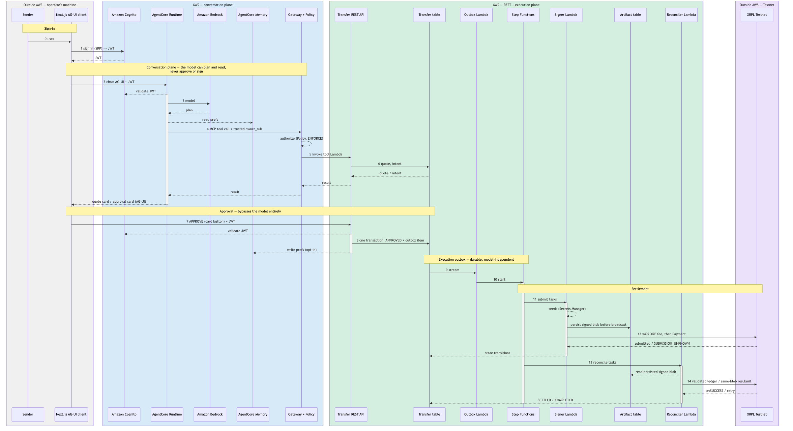

# Architecture and safety boundary


_Regenerate with `pip install -r diagrams/requirements.txt && python3 diagrams/render_architecture.py` (icons: see [`diagrams/icons/SOURCE.md`](../diagrams/icons/SOURCE.md))._

[Standalone ASCII architecture](architecture-ascii.md) · [Control-flow sequence, with trust-boundary swimlanes](sequence.md)

The POC separates conversation, durable authorization, signing, settlement
verification, and payout finalization. An LLM can help a user discover a
[corridor](https://en.wikipedia.org/wiki/Remittance) — the remittance-industry
term for a fixed source-currency → destination-currency route, such as
USD→MXN — obtain a quote, create an intent, and read status. It cannot
approve or execute a transfer. Each corridor in `config/corridors.json` pins a
specific pair of XRPL issuers and a demo exchange rate; see `CorridorService`
in [`src/xrpl_agentcore/services.py`](../src/xrpl_agentcore/services.py).

```text
Browser
  │ Cognito JWT
  ▼
Next.js AG-UI BFF ────────────► Transfer REST API ──► DynamoDB transfer table
  │ AG-UI + JWT                        │ approval             │ stream outbox
  ▼                                    │                      ▼
AgentCore Runtime                      │                Step Functions
  │ IAM + trusted owner_sub            │                   │       │
  ▼                                    │                   ▼       ▼
AgentCore Gateway + Policy             │                Signer   Reconciler
  │ four planning/status tools         │                   │       │
  └────────────────────────────────────┘                   ▼       ▼
                                                      XRPL Testnet
```

The numbered sequence below is the same flow with every hop, its trust
boundary, and the model-vs-approval split spelled out — read this first if
the ASCII sketch above is too compressed.



_Mermaid source and regenerate command: [`docs/sequence.md`](sequence.md)._

The signer persists a deterministic signed transaction in the separately
encrypted artifact table before broadcast. A network timeout after signing is
`SUBMISSION_UNKNOWN`, not failure. The reconciler has only public wallet
identities and read-only artifact access. It declares settlement only after a
validated `tesSUCCESS` Payment matches the prepared hash, source, destination,
workflow memo, approved `Amount`, and exact delivered amount. Every pending
reconciliation cycle resubmits the persisted signed blob unchanged until
validation or `LastLedgerSequence` expiry.

## AgentCore boundaries

- Runtime: native AG-UI on port 8080 with `POST /invocations`, `GET /ping`,
  Cognito JWT validation, model invocation, read-only preference recall, and
  Gateway invocation.
- Gateway: exactly four tools—corridors, quotes, intent creation, and status.
  The Runtime injects the authenticated Cognito subject; model arguments cannot
  replace it.
- Policy: enforcement mode with four explicit Runtime-to-tool permits, plus
  one narrow exception — `list_supported_corridors` only — for the registry
  discovery demo's consumer role (see [Agent Registry](#agent-registry)).
  Everything else is denied by absence of a permit.
- Memory: off by default and limited to structured corridor, payout, and
  slippage preferences under `/preferences/{actorId}/`.
- Payments: AgentCore Payments is not used because XRPL is not a supported
  instrument. `XrplX402Adapter` is an isolated replacement point.

## Agent Registry

`infra/lib/xrpl-agentcore-stack.ts` declares one `AWS::AgentRegistry::Registry`
(IAM-authorized, auto-approved — a single-account demo catalog with no
separate curator) and three records:

- **Gateway, as an `MCP` record.** Synced live from `gateway.gatewayUrl` via
  an IAM credential provider — a dedicated `RegistrySyncRole`, assumable only
  by `agent-registry.amazonaws.com` (not `bedrock-agentcore.amazonaws.com`,
  which is only correct for the deprecated preview namespace — confirmed live
  by a failed sync until fixed), scoped to `bedrock-agentcore:InvokeGateway`
  on this one Gateway. Sync populates the server URL and metadata, but the
  synced **tool list comes back empty**: the sync role has no Policy Engine
  permit, so its own `tools/list` call is denied by the same default-deny
  Policy that gates everything else on this Gateway. Fixing that would mean
  granting `RegistrySyncRole` a Policy permit too — deliberately not done
  here; see the demo-role tradeoff below.
- **Runtime, as a `CUSTOM` record.** The registry's AG-UI descriptor is
  source-only and, per AWS's registry-sync docs, live sync currently only
  covers `mcpServer`/`a2aAgentCard` sources — and source-only descriptors
  don't accept credentials regardless, which the Runtime's Cognito-JWT
  authorizer requires. So this record is a self-authored JSON blob (protocol,
  Runtime ARN, auth model) rather than a live sync, and only deploys when the
  Runtime itself does (`DeployAgentRuntimeCondition`).
- **`xrpl-agent-wallet` and `xrpl-payments`, as `SKILL` records.** Each
  record's `AgentSkillsMdDescriptor` is populated straight from that skill's
  `SKILL.md` under `.claude/skills/`, read at synth time — the registry stays
  in sync with the source of truth on every deploy, no separate copy to
  maintain. AWS's own control plane parses the frontmatter and enforces a
  1024-character `description` limit; `xrpl-agent-wallet`'s exceeded it by a
  few characters, so the copy sent to the registry (never the source
  `SKILL.md`) is truncated to fit.
- **Demo consumer role, proving the registry is a real access boundary.**
  `RegistryConsumerDemoRole` (see `scripts/demo_registry_discovery.py`) knows
  only the registry ID — never the Gateway URL or ARNs — and can search the
  registry, read approved records, and call exactly one tool:
  `list_supported_corridors`, via one narrow Policy Engine permit added
  alongside the Runtime's four. That permit is a deliberate, disclosed
  exception to "Runtime role only," scoped to a single read-only,
  non-owner-scoped tool — not a general opening.

## Approval commitment

The SHA-256 approval commitment canonicalizes and binds the contract version,
authenticated owner, transfer ID, payout mode, source and destination amounts
and issued assets, issuers, recipient and destination tag, selected path,
bounded `SendMax`, slippage, XRP x402 fee, quote expiry, and quote/transfer
nonces. Transfer intent IDs are deterministic per owner and quote, so a retried
Gateway or REST invocation returns the existing intent instead of creating
another chargeable transfer. Approval and execution-outbox creation are one
DynamoDB transaction.
TTL is cleanup only; every approval and execution boundary checks expiry.

## Product UI

AG-UI streams conversation and invokes only application-owned quote, approval,
fee progress, settlement, receipt, and failure components. Those components
poll the REST status API while nonterminal, so browser refreshes and completed
Runtime sessions do not affect execution. Authentication, history, settings,
and fixture administration are ordinary Next.js screens.

Shared AG-UI state and the model-facing Gateway projection reject unknown keys
and credential/signing/PII-shaped fields. They never include seeds, signed
blobs, bank details, JWTs, approval credentials, paths, or recipient wallet
addresses. The owner-authenticated REST projection separately supplies the
exact approval terms to the application-owned card, including recipient
address/tag, issuer identities, slippage, expiry, and commitment. The approval
button calls the authenticated REST endpoint directly. The browser uses a
native AG-UI client; no third-party chat framework or telemetry is involved.

## Explicit demo boundary

Only XRPL Testnet is accepted in code and infrastructure. USD and MXN are
private Testnet issued-currency fixtures; sanctions outcomes and local-fiat
payouts are simulated. Mainnet, real custody, production KYC/AML, and real bank
movement are out of scope.
