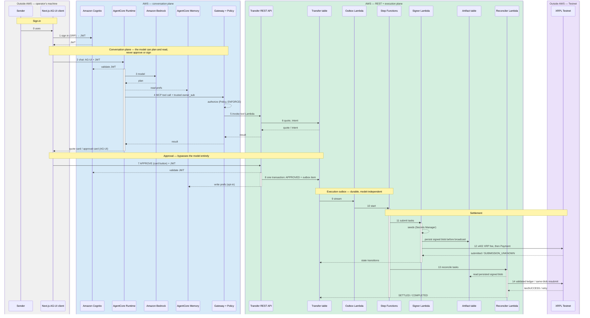

# Control-flow sequence

Numbers match [`docs/architecture.md`](architecture.md) and its diagram —
step *N* here is the same hop as step *N* there. Solid arrows are the
numbered request path; dotted arrows are auth, credential, or side-effect
hops that happen alongside it. The four boxes are the trust boundaries: two
outside AWS (the operator's machine and the public XRPL Testnet), and AWS's
own conversation plane and execution plane, split exactly as in the component
diagram's zones.

_Regenerate the PNG with `npx -y @mermaid-js/mermaid-cli -i docs/sequence.md -o docs/assets/sequence.png` after editing the block below — see [Prerequisites](../README.md#prerequisites) for Node. Read the rendered PNG after regenerating; this file has no automated topology check._

